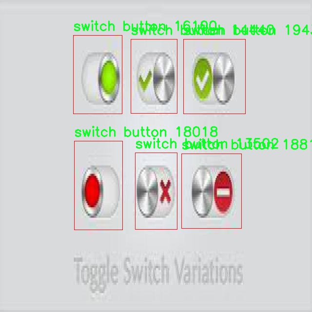

# 用户界面元素检测检测系统源码分享
 # [一条龙教学YOLOV8标注好的数据集一键训练_70+全套改进创新点发刊_Web前端展示]

### 1.研究背景与意义

项目参考[AAAI Association for the Advancement of Artificial Intelligence](https://gitee.com/qunmasj/projects)

项目来源[AACV Association for the Advancement of Computer Vision](https://kdocs.cn/l/cszuIiCKVNis)

研究背景与意义

随着信息技术的迅猛发展，用户界面（UI）设计在软件开发和应用程序中扮演着越来越重要的角色。用户界面的设计不仅影响用户的使用体验，还直接关系到产品的市场竞争力。为了提高用户界面的可用性和美观性，设计师们需要对界面元素进行精确的识别和分析。因此，开发一种高效的用户界面元素检测系统显得尤为重要。近年来，深度学习技术的进步为目标检测提供了新的解决方案，其中YOLO（You Only Look Once）系列模型因其高效性和准确性受到广泛关注。特别是YOLOv8模型，凭借其在速度和精度上的优势，成为了目标检测领域的研究热点。

本研究旨在基于改进的YOLOv8模型，构建一个高效的用户界面元素检测系统。该系统将针对9186张图像进行训练，这些图像涵盖了11个类别的用户界面元素，包括按钮、复选框、组合框、数据网格、下拉菜单、图标按钮、标签、单选按钮、滑块、开关按钮和文本输入框。这些类别的多样性使得系统能够在不同的应用场景中进行有效的元素识别，从而为用户界面的自动化设计和优化提供支持。

在当前的研究背景下，尽管已有一些针对用户界面元素检测的研究，但大多数方法仍存在准确性不足、处理速度慢等问题。传统的目标检测方法往往依赖于手工特征提取，难以适应复杂多变的用户界面设计。而基于深度学习的YOLOv8模型通过端到端的学习方式，能够自动提取特征，显著提高检测的准确性和效率。此外，YOLOv8的实时检测能力使其在实际应用中具有更高的实用价值。

本研究的意义在于，通过改进YOLOv8模型，提升用户界面元素的检测性能，为UI设计师提供更为强大的工具支持。具体而言，改进后的检测系统能够在设计阶段快速识别和分析界面元素，帮助设计师及时发现潜在问题，优化用户体验。同时，该系统还可以为后续的自动化设计和用户行为分析提供数据支持，推动智能设计的发展。

此外，随着人工智能技术的不断进步，用户界面元素检测系统的应用前景广阔。它不仅可以用于软件开发和测试，还可以扩展到智能家居、虚拟现实、增强现实等领域，为人机交互提供更加自然和直观的体验。因此，本研究不仅具有理论价值，也具备重要的应用潜力，能够为相关领域的研究和实践提供新的思路和方法。

综上所述，基于改进YOLOv8的用户界面元素检测系统的研究，不仅能够推动目标检测技术的发展，还将为用户界面的设计与优化提供切实可行的解决方案，具有重要的学术价值和实际意义。

### 2.图片演示


##### 注意：由于此博客编辑较早，上面“2.图片演示”和“3.视频演示”展示的系统图片或者视频可能为老版本，新版本在老版本的基础上升级如下：（实际效果以升级的新版本为准）

  （1）适配了YOLOV8的“目标检测”模型和“实例分割”模型，通过加载相应的权重（.pt）文件即可自适应加载模型。

  （2）支持“图片识别”、“视频识别”、“摄像头实时识别”三种识别模式。

  （3）支持“图片识别”、“视频识别”、“摄像头实时识别”三种识别结果保存导出，解决手动导出（容易卡顿出现爆内存）存在的问题，识别完自动保存结果并导出到tempDir中。

  （4）支持Web前端系统中的标题、背景图等自定义修改，后面提供修改教程。

  另外本项目提供训练的数据集和训练教程,暂不提供权重文件（best.pt）,需要您按照教程进行训练后实现图片演示和Web前端界面演示的效果。

### 3.视频演示

[3.1 视频演示](https://www.bilibili.com/video/BV1vGxjeFEXb/)

### 4.数据集信息展示

##### 4.1 本项目数据集详细数据（类别数＆类别名）

nc: 11
names: ['button', 'check box', 'combo box', 'data grid', 'dropdown', 'icon button', 'label', 'radio button', 'slider', 'switch button', 'text input']


##### 4.2 本项目数据集信息介绍

数据集信息展示

在现代软件开发中，用户界面（UI）元素的自动检测与识别是提升用户体验和界面设计效率的重要环节。为此，我们构建了一个名为“UI Det”的数据集，旨在为改进YOLOv8的用户界面元素检测系统提供高质量的训练数据。该数据集专注于多种常见的用户界面组件，涵盖了11个类别，分别是：按钮（button）、复选框（check box）、组合框（combo box）、数据网格（data grid）、下拉菜单（dropdown）、图标按钮（icon button）、标签（label）、单选按钮（radio button）、滑块（slider）、开关按钮（switch button）和文本输入框（text input）。

“UI Det”数据集的构建过程经历了严格的筛选与标注，以确保每个类别的样本具有代表性和多样性。数据集中的每个类别都包含了大量的图像，这些图像来自于不同的应用程序和网站，涵盖了各种设计风格和布局。这种多样性不仅有助于模型学习到更为广泛的特征，还能增强其在实际应用中的鲁棒性。例如，按钮类别的样本包括了圆形、方形、扁平化和立体化等不同风格的按钮，复选框和单选按钮则展示了不同状态（选中与未选中）的视觉效果。

在数据集的标注过程中，我们采用了精细化的标注策略，确保每个UI元素的边界框准确无误。通过这种方式，模型能够学习到不同UI元素的形状、大小和相对位置，从而在检测时更为精准。此外，为了提高模型的泛化能力，我们还对图像进行了多种数据增强处理，包括旋转、缩放、翻转和颜色调整等。这些增强手段不仅丰富了数据集的多样性，也使得模型在面对不同环境和光照条件时，能够保持较高的检测准确率。

在实际应用中，UI Det数据集的价值不仅体现在模型训练阶段，更在于其对用户界面设计和开发流程的推动。通过自动化的UI元素检测，开发者可以更快速地识别和调整界面中的各个组件，从而提升开发效率和用户体验。尤其是在快速迭代的开发环境中，能够及时获取UI元素的反馈，将大大缩短产品上线的周期。

总之，“UI Det”数据集为改进YOLOv8的用户界面元素检测系统提供了坚实的基础。通过对11个类别的全面覆盖和高质量的标注，该数据集不仅为模型的训练提供了丰富的素材，也为未来的研究和应用奠定了良好的基础。随着技术的不断进步和应用场景的不断扩展，我们期待“UI Det”数据集能够在用户界面自动化检测领域发挥更大的作用，推动整个行业的进步与发展。




### 5.全套项目环境部署视频教程（零基础手把手教学）

[5.1 环境部署教程链接（零基础手把手教学）](https://www.ixigua.com/7404473917358506534?logTag=c807d0cbc21c0ef59de5)


[5.2 安装Python虚拟环境创建和依赖库安装视频教程链接（零基础手把手教学）](https://www.ixigua.com/7404474678003106304?logTag=1f1041108cd1f708b01a)

### 6.手把手YOLOV8训练视频教程（零基础小白有手就能学会）

[6.1 手把手YOLOV8训练视频教程（零基础小白有手就能学会）](https://www.ixigua.com/7404477157818401292?logTag=d31a2dfd1983c9668658)

### 7.70+种全套YOLOV8创新点代码加载调参视频教程（一键加载写好的改进模型的配置文件）

[7.1 70+种全套YOLOV8创新点代码加载调参视频教程（一键加载写好的改进模型的配置文件）](https://www.ixigua.com/7404478314661806627?logTag=29066f8288e3f4eea3a4)

### 8.70+种全套YOLOV8创新点原理讲解（非科班也可以轻松写刊发刊，V10版本正在科研待更新）

由于篇幅限制，每个创新点的具体原理讲解就不一一展开，具体见下列网址中的创新点对应子项目的技术原理博客网址【Blog】：


[8.1 70+种全套YOLOV8创新点原理讲解链接](https://gitee.com/qunmasj/good)

### 9.系统功能展示（检测对象为举例，实际内容以本项目数据集为准）

图9.1.系统支持检测结果表格显示

  图9.2.系统支持置信度和IOU阈值手动调节

  图9.3.系统支持自定义加载权重文件best.pt(需要你通过步骤5中训练获得)

  图9.4.系统支持摄像头实时识别

  图9.5.系统支持图片识别

  图9.6.系统支持视频识别

  图9.7.系统支持识别结果文件自动保存

  图9.8.系统支持Excel导出检测结果数据


### 10.原始YOLOV8算法原理

原始YOLOv8算法原理

YOLOv8算法是由Ultralytics公司在2023年推出的目标检测算法，作为YOLO系列的最新版本，它在前几代的基础上进行了多项创新和改进。YOLOv8不仅在准确性和速度上进行了优化，还在模型的灵活性和易用性方面做出了显著提升。其设计理念围绕着快速、准确和易于使用的目标检测、图像分割和图像分类任务展开，使其成为了广泛应用的理想选择。

YOLOv8的网络结构由三个主要部分组成：输入层（Input）、主干网络（Backbone）和检测头（Head）。在输入层，YOLOv8默认的图像尺寸为640x640像素，但为了适应不同长宽比的图像，算法采用了自适应图片缩放的策略。这种策略通过将图像的长边按比例缩小到指定尺寸，然后对短边进行填充，从而有效减少了信息冗余，提升了目标检测和推理的速度。此外，在训练过程中，YOLOv8引入了Mosaic图像增强技术，通过将四张不同的训练图像随机缩放并拼接，生成新的训练样本，促使模型学习到不同位置和周围像素的特征，从而提高了预测精度。

在主干网络部分，YOLOv8对传统的C3模块进行了替换，采用了C2F模块。C2F模块的设计灵感来源于YOLOv7中的ELAN模块，具有更多的并行梯度流分支，能够在保证模型轻量化的同时，获取更丰富的梯度信息。这种结构的变化使得YOLOv8在特征提取的过程中更加高效，能够更好地捕捉不同尺度的特征信息。此外，YOLOv8依然采用了FPN（特征金字塔网络）和PAN（路径聚合网络）结构，以充分融合多尺度信息，从而增强模型的检测能力。

在检测头部分，YOLOv8进行了显著的改进，采用了解耦合头（Decoupled Head）结构。这一结构将分类和定位任务分开处理，分别通过两个1x1卷积模块进行特征提取，进而提高了分类和定位的精度。与以往的耦合头结构相比，解耦合头的设计使得模型在处理复杂场景时，能够更灵活地适应不同的任务需求。

YOLOv8在标签分配策略上也进行了创新，采用了动态标签分配策略（TOOD），解决了传统候选框聚类方法的局限性。YOLOv8不再依赖于数据集的分布特征，而是通过动态分配正负样本，优化了训练过程中的样本匹配。这一策略使得模型在面对不同规模和形状的目标时，能够更加灵活地进行学习和适应。

在损失函数的设计上，YOLOv8采用了Varifocal Loss（VFL）作为分类损失，结合CIoULoss和DFLLoss作为回归损失。VFL通过对正负样本进行不对称加权，增强了模型对高质量样本的关注度，从而提升了检测精度。CIoULoss则在边界框回归中引入了更精确的度量标准，使得模型在训练过程中能够更快地聚焦于标签附近的数值，提高了定位的准确性。

总的来说，YOLOv8在多个方面进行了创新和优化，尤其是在网络结构、标签分配和损失函数设计上。这些改进使得YOLOv8在目标检测任务中表现出色，能够在复杂的场景中快速、准确地识别和定位目标。通过结合先进的深度学习技术和灵活的网络设计，YOLOv8为目标检测领域提供了一个强大而高效的解决方案，展现了YOLO系列算法不断演进的潜力和前景。


### 11.项目核心源码讲解（再也不用担心看不懂代码逻辑）

#### 11.1 code\ultralytics\models\yolo\segment\__init__.py

以下是对给定代码的核心部分进行分析和详细注释的结果：

```python
# Ultralytics YOLO 🚀, AGPL-3.0 license

# 从当前模块导入三个类：SegmentationPredictor、SegmentationTrainer 和 SegmentationValidator
from .predict import SegmentationPredictor  # 导入用于图像分割预测的类
from .train import SegmentationTrainer      # 导入用于训练图像分割模型的类
from .val import SegmentationValidator       # 导入用于验证图像分割模型的类

# 定义模块的公共接口，指定可以被外部访问的类
__all__ = "SegmentationPredictor", "SegmentationTrainer", "SegmentationValidator"
```

### 代码分析
1. **模块导入**：
   - 代码中使用了相对导入的方式，从当前模块中导入了三个类。这些类分别负责图像分割的不同功能：
     - `SegmentationPredictor`：用于进行图像分割的预测。
     - `SegmentationTrainer`：用于训练图像分割模型。
     - `SegmentationValidator`：用于验证图像分割模型的性能。

2. **公共接口定义**：
   - `__all__` 变量定义了模块的公共接口，只有在使用 `from module import *` 语句时，列出的类才会被导入。这有助于控制模块的可见性，避免不必要的命名冲突。

### 结论
该代码片段的核心功能是组织和导出图像分割相关的类，以便其他模块可以方便地使用这些功能。通过清晰的模块结构和公共接口定义，代码的可维护性和可读性得到了提升。

这个文件是Ultralytics YOLO项目中的一个初始化文件，位于`code/ultralytics/models/yolo/segment/`目录下。它的主要作用是定义该模块的公共接口，并导入与分割相关的类。

文件的开头有一行注释，表明这是Ultralytics YOLO项目的一部分，并提到该项目使用AGPL-3.0许可证。这种许可证要求任何基于该代码的衍生作品也必须以相同的许可证发布，确保开源的性质。

接下来，文件导入了三个类：`SegmentationPredictor`、`SegmentationTrainer`和`SegmentationValidator`。这些类分别负责图像分割任务中的预测、训练和验证功能。通过将这些类导入到模块中，用户可以方便地使用它们，而无需了解其具体实现细节。

最后，`__all__`变量被定义为一个元组，包含了上述三个类的名称。这意味着当使用`from module import *`语句时，只会导入这些指定的类，确保模块的公共接口清晰且易于管理。

总的来说，这个初始化文件为YOLO分割模块提供了一个简洁的接口，使得用户能够轻松地访问和使用与图像分割相关的功能。

#### 11.2 70+种YOLOv8算法改进源码大全和调试加载训练教程（非必要）\ultralytics\data\converter.py

以下是代码中最核心的部分，并附上详细的中文注释：

```python
def coco91_to_coco80_class():
    """
    将91个COCO类ID转换为80个COCO类ID。

    返回:
        (list): 一个包含91个类ID的列表，其中索引表示80个类ID，值为对应的91个类ID。
    """
    return [
        0, 1, 2, 3, 4, 5, 6, 7, 8, 9, 10, None, 11, 12, 13, 14, 15, 16, 17, 18, 19, 20, 21, 22, 23, None, 24, 25, None,
        None, 26, 27, 28, 29, 30, 31, 32, 33, 34, 35, 36, 37, 38, 39, None, 40, 41, 42, 43, 44, 45, 46, 47, 48, 49, 50,
        51, 52, 53, 54, 55, 56, 57, 58, 59, None, 60, None, None, 61, None, 62, 63, 64, 65, 66, 67, 68, 69, 70, 71, 72,
        None, 73, 74, 75, 76, 77, 78, 79, None]


def convert_coco(labels_dir='../coco/annotations/',
                 save_dir='coco_converted/',
                 use_segments=False,
                 use_keypoints=False,
                 cls91to80=True):
    """
    将COCO数据集的注释转换为适合训练YOLO模型的YOLO注释格式。

    参数:
        labels_dir (str, optional): 包含COCO数据集注释文件的目录路径。
        save_dir (str, optional): 保存结果的目录路径。
        use_segments (bool, optional): 是否在输出中包含分割掩码。
        use_keypoints (bool, optional): 是否在输出中包含关键点注释。
        cls91to80 (bool, optional): 是否将91个COCO类ID映射到对应的80个COCO类ID。

    输出:
        在指定的输出目录中生成输出文件。
    """

    # 创建数据集目录
    save_dir = increment_path(save_dir)  # 如果保存目录已存在，则增加后缀
    for p in save_dir / 'labels', save_dir / 'images':
        p.mkdir(parents=True, exist_ok=True)  # 创建目录

    # 转换类
    coco80 = coco91_to_coco80_class()  # 获取COCO 80类映射

    # 导入json文件
    for json_file in sorted(Path(labels_dir).resolve().glob('*.json')):
        fn = Path(save_dir) / 'labels' / json_file.stem.replace('instances_', '')  # 文件夹名称
        fn.mkdir(parents=True, exist_ok=True)
        with open(json_file) as f:
            data = json.load(f)  # 读取json数据

        # 创建图像字典
        images = {f'{x["id"]:d}': x for x in data['images']}
        # 创建图像-注释字典
        imgToAnns = defaultdict(list)
        for ann in data['annotations']:
            imgToAnns[ann['image_id']].append(ann)

        # 写入标签文件
        for img_id, anns in TQDM(imgToAnns.items(), desc=f'Annotations {json_file}'):
            img = images[f'{img_id:d}']
            h, w, f = img['height'], img['width'], img['file_name']

            bboxes = []  # 存储边界框
            segments = []  # 存储分割
            keypoints = []  # 存储关键点
            for ann in anns:
                if ann['iscrowd']:
                    continue  # 跳过人群注释
                # COCO框格式为 [左上角x, 左上角y, 宽度, 高度]
                box = np.array(ann['bbox'], dtype=np.float64)
                box[:2] += box[2:] / 2  # 将左上角坐标转换为中心坐标
                box[[0, 2]] /= w  # 归一化x坐标
                box[[1, 3]] /= h  # 归一化y坐标
                if box[2] <= 0 or box[3] <= 0:  # 如果宽度或高度小于等于0
                    continue

                cls = coco80[ann['category_id'] - 1] if cls91to80 else ann['category_id'] - 1  # 类别
                box = [cls] + box.tolist()  # 将类别和边界框合并
                if box not in bboxes:
                    bboxes.append(box)  # 添加边界框
                if use_segments and ann.get('segmentation') is not None:
                    # 处理分割
                    if len(ann['segmentation']) == 0:
                        segments.append([])
                        continue
                    elif len(ann['segmentation']) > 1:
                        s = merge_multi_segment(ann['segmentation'])  # 合并多个分割
                        s = (np.concatenate(s, axis=0) / np.array([w, h])).reshape(-1).tolist()
                    else:
                        s = [j for i in ann['segmentation'] for j in i]  # 所有分割连接
                        s = (np.array(s).reshape(-1, 2) / np.array([w, h])).reshape(-1).tolist()
                    s = [cls] + s
                    if s not in segments:
                        segments.append(s)  # 添加分割
                if use_keypoints and ann.get('keypoints') is not None:
                    keypoints.append(box + (np.array(ann['keypoints']).reshape(-1, 3) /
                                            np.array([w, h, 1])).reshape(-1).tolist())

            # 写入文件
            with open((fn / f).with_suffix('.txt'), 'a') as file:
                for i in range(len(bboxes)):
                    if use_keypoints:
                        line = *(keypoints[i]),  # 类别, 边界框, 关键点
                    else:
                        line = *(segments[i]
                                 if use_segments and len(segments[i]) > 0 else bboxes[i]),  # 类别, 边界框或分割
                    file.write(('%g ' * len(line)).rstrip() % line + '\n')

    LOGGER.info(f'COCO数据成功转换。\n结果保存到 {save_dir.resolve()}')
```

### 代码核心部分解释
1. **coco91_to_coco80_class**: 该函数将91个COCO类ID映射到80个COCO类ID，返回一个列表，列表的索引对应80个类ID，值为对应的91个类ID。

2. **convert_coco**: 该函数是将COCO数据集的注释转换为YOLO格式的核心函数。它接收多个参数，包括注释文件的目录、保存结果的目录、是否使用分割和关键点等。函数内部创建必要的目录，读取COCO的JSON注释文件，解析每个图像的注释并生成YOLO格式的标签文件。

3. **边界框处理**: 在处理每个注释时，函数将COCO的边界框格式转换为YOLO格式，进行归一化处理，并根据需要处理分割和关键点。

4. **文件写入**: 最后，函数将生成的边界框、分割和关键点信息写入到指定的文本文件中，形成YOLO所需的标签格式。

通过这些核心部分，代码实现了从COCO数据集到YOLO格式的转换，便于后续的模型训练。

这个程序文件主要用于将COCO数据集的标注格式转换为YOLO模型所需的标注格式，同时也支持将DOTA数据集的标注转换为YOLO的方向性边界框（OBB）格式。文件中包含多个函数，每个函数负责特定的转换任务。

首先，`coco91_to_coco80_class`和`coco80_to_coco91_class`这两个函数分别用于将COCO数据集中91个类别的ID转换为80个类别的ID，反之亦然。这是因为YOLO模型通常使用80个类别，而COCO数据集原始的类别数为91。函数返回一个列表，其中索引代表80个类别的ID，值则是对应的91个类别的ID。

接下来，`convert_coco`函数是核心功能，它将COCO数据集的标注文件转换为YOLO格式。函数接受多个参数，包括标注文件的目录、保存结果的目录、是否使用分割掩码和关键点等。函数首先创建保存结果的目录，然后读取指定目录下的JSON标注文件。接着，它将每个图像的标注信息提取出来，转换为YOLO格式并保存到指定的目录中。转换过程中，函数会处理边界框的坐标，将其从COCO格式转换为YOLO格式，并根据需要处理分割和关键点信息。

`convert_dota_to_yolo_obb`函数则专门用于将DOTA数据集的标注转换为YOLO OBB格式。它会遍历DOTA数据集中的训练和验证图像，读取原始标注文件，并将其转换为YOLO OBB格式。函数内部定义了一个`convert_label`辅助函数，用于处理单个图像的标注转换。

此外，文件中还包含一些辅助函数，例如`min_index`用于计算两个二维点数组之间的最短距离的索引对，`merge_multi_segment`用于合并多个分割线段，将它们连接成一个连续的线段。这些辅助函数在处理复杂的标注数据时非常有用。

总体而言，这个程序文件提供了一种方便的方式来处理和转换常用的目标检测数据集标注格式，以便于使用YOLO模型进行训练和推理。通过这些函数，用户可以轻松地将COCO和DOTA数据集的标注转换为YOLO所需的格式，从而加速模型的训练过程。

#### 11.3 ui.py

以下是经过简化并添加详细中文注释的核心代码部分：

```python
import sys
import subprocess

def run_script(script_path):
    """
    使用当前 Python 环境运行指定的脚本。

    Args:
        script_path (str): 要运行的脚本路径

    Returns:
        None
    """
    # 获取当前 Python 解释器的路径
    python_path = sys.executable

    # 构建运行命令，使用 streamlit 运行指定的脚本
    command = f'"{python_path}" -m streamlit run "{script_path}"'

    # 执行命令
    result = subprocess.run(command, shell=True)
    
    # 检查命令执行结果，如果返回码不为0，则表示出错
    if result.returncode != 0:
        print("脚本运行出错。")

# 主程序入口
if __name__ == "__main__":
    # 指定要运行的脚本路径
    script_path = "web.py"  # 这里可以直接指定脚本名，假设在当前目录下

    # 调用函数运行脚本
    run_script(script_path)
```

### 代码说明：
1. **导入模块**：
   - `sys`：用于获取当前 Python 解释器的路径。
   - `subprocess`：用于执行外部命令。

2. **定义 `run_script` 函数**：
   - 该函数接收一个脚本路径作为参数，并使用当前 Python 环境运行该脚本。
   - 通过 `sys.executable` 获取当前 Python 解释器的路径。
   - 构建一个命令字符串，使用 `streamlit` 运行指定的脚本。
   - 使用 `subprocess.run` 执行命令，并检查返回码以判断脚本是否成功运行。

3. **主程序入口**：
   - 使用 `if __name__ == "__main__":` 确保代码仅在直接运行时执行。
   - 指定要运行的脚本路径（在此示例中为 `web.py`）。
   - 调用 `run_script` 函数来执行该脚本。

这个程序文件名为 `ui.py`，主要功能是通过当前的 Python 环境运行一个指定的脚本，具体是一个名为 `web.py` 的文件。程序首先导入了必要的模块，包括 `sys`、`os` 和 `subprocess`，以及一个自定义的 `abs_path` 函数，用于获取文件的绝对路径。

在 `run_script` 函数中，程序接受一个参数 `script_path`，该参数是要运行的脚本的路径。函数内部首先获取当前 Python 解释器的路径，这通过 `sys.executable` 实现。接着，程序构建了一个命令字符串，使用 `streamlit` 模块来运行指定的脚本。命令的格式是 `"{python_path}" -m streamlit run "{script_path}"`，其中 `python_path` 是当前 Python 解释器的路径，`script_path` 是要运行的脚本路径。

然后，程序使用 `subprocess.run` 方法执行构建好的命令，并设置 `shell=True` 以便在 shell 中运行该命令。执行后，程序检查返回码，如果返回码不为 0，表示脚本运行出错，此时会打印出相应的错误信息。

在文件的最后部分，程序通过 `if __name__ == "__main__":` 判断当前模块是否是主程序。如果是，则指定要运行的脚本路径为 `web.py` 的绝对路径，并调用 `run_script` 函数来执行该脚本。

总的来说，这个程序的核心功能是封装了一个简单的脚本运行机制，方便用户在当前 Python 环境中启动并运行指定的 `web.py` 脚本。

#### 11.4 train.py

以下是经过简化和注释的核心代码部分，主要集中在 YOLO 模型的训练过程中：

```python
import random
import numpy as np
import torch.nn as nn
from ultralytics.data import build_dataloader, build_yolo_dataset
from ultralytics.engine.trainer import BaseTrainer
from ultralytics.models import yolo
from ultralytics.nn.tasks import DetectionModel
from ultralytics.utils import LOGGER, RANK
from ultralytics.utils.torch_utils import de_parallel, torch_distributed_zero_first

class DetectionTrainer(BaseTrainer):
    """
    扩展 BaseTrainer 类，用于基于检测模型的训练。
    """

    def build_dataset(self, img_path, mode="train", batch=None):
        """
        构建 YOLO 数据集。

        参数:
            img_path (str): 包含图像的文件夹路径。
            mode (str): 模式，'train' 或 'val'，用户可以为每种模式自定义不同的增强。
            batch (int, optional): 批次大小，适用于 'rect' 模式。默认为 None。
        """
        gs = max(int(de_parallel(self.model).stride.max() if self.model else 0), 32)
        return build_yolo_dataset(self.args, img_path, batch, self.data, mode=mode, rect=mode == "val", stride=gs)

    def get_dataloader(self, dataset_path, batch_size=16, rank=0, mode="train"):
        """构造并返回数据加载器。"""
        assert mode in ["train", "val"]
        with torch_distributed_zero_first(rank):  # 仅在 DDP 中初始化数据集 *.cache 一次
            dataset = self.build_dataset(dataset_path, mode, batch_size)
        shuffle = mode == "train"  # 训练模式下打乱数据
        workers = self.args.workers if mode == "train" else self.args.workers * 2
        return build_dataloader(dataset, batch_size, workers, shuffle, rank)  # 返回数据加载器

    def preprocess_batch(self, batch):
        """对图像批次进行预处理，包括缩放和转换为浮点数。"""
        batch["img"] = batch["img"].to(self.device, non_blocking=True).float() / 255  # 归一化图像
        if self.args.multi_scale:  # 如果启用多尺度
            imgs = batch["img"]
            sz = (
                random.randrange(self.args.imgsz * 0.5, self.args.imgsz * 1.5 + self.stride)
                // self.stride
                * self.stride
            )  # 随机选择图像大小
            sf = sz / max(imgs.shape[2:])  # 计算缩放因子
            if sf != 1:
                ns = [
                    math.ceil(x * sf / self.stride) * self.stride for x in imgs.shape[2:]
                ]  # 计算新的形状
                imgs = nn.functional.interpolate(imgs, size=ns, mode="bilinear", align_corners=False)  # 调整图像大小
            batch["img"] = imgs
        return batch

    def get_model(self, cfg=None, weights=None, verbose=True):
        """返回 YOLO 检测模型。"""
        model = DetectionModel(cfg, nc=self.data["nc"], verbose=verbose and RANK == -1)
        if weights:
            model.load(weights)  # 加载模型权重
        return model

    def plot_training_samples(self, batch, ni):
        """绘制带有注释的训练样本。"""
        plot_images(
            images=batch["img"],
            batch_idx=batch["batch_idx"],
            cls=batch["cls"].squeeze(-1),
            bboxes=batch["bboxes"],
            paths=batch["im_file"],
            fname=self.save_dir / f"train_batch{ni}.jpg",
            on_plot=self.on_plot,
        )

    def plot_metrics(self):
        """从 CSV 文件中绘制指标。"""
        plot_results(file=self.csv, on_plot=self.on_plot)  # 保存结果图
```

### 代码注释说明：
1. **build_dataset**: 该方法用于构建 YOLO 数据集，支持训练和验证模式，并可以根据需要进行数据增强。
2. **get_dataloader**: 该方法创建数据加载器，支持分布式训练，能够处理数据的打乱和工作线程的设置。
3. **preprocess_batch**: 该方法对输入的图像批次进行预处理，包括归一化和根据需要调整图像大小。
4. **get_model**: 该方法返回一个 YOLO 检测模型，并可以选择性地加载预训练权重。
5. **plot_training_samples**: 该方法用于绘制训练样本及其对应的注释，便于可视化训练过程。
6. **plot_metrics**: 该方法用于从 CSV 文件中绘制训练过程中的指标，帮助分析模型性能。

这个程序文件 `train.py` 是一个用于训练 YOLO（You Only Look Once）目标检测模型的脚本，继承自 `BaseTrainer` 类。程序的主要功能是构建数据集、创建数据加载器、预处理图像、设置模型属性、获取模型、进行验证、记录损失、显示训练进度、绘制训练样本和指标等。

首先，程序导入了一些必要的库和模块，包括数学运算、随机数生成、深度学习框架 PyTorch 相关的模块，以及 YOLO 相关的工具和数据处理函数。接着定义了 `DetectionTrainer` 类，该类主要负责目标检测模型的训练过程。

在 `build_dataset` 方法中，程序根据给定的图像路径和模式（训练或验证）构建 YOLO 数据集。这个方法允许用户为不同的模式自定义数据增强策略。`get_dataloader` 方法则负责构建数据加载器，确保在分布式训练时只初始化一次数据集，并根据模式设置是否打乱数据。

`preprocess_batch` 方法用于对图像批次进行预处理，包括将图像缩放到合适的大小并转换为浮点数格式。该方法还支持多尺度训练，通过随机选择图像大小来增强模型的鲁棒性。

`set_model_attributes` 方法用于设置模型的属性，包括类别数量和类别名称等，以确保模型能够正确处理数据集中的类别信息。`get_model` 方法则返回一个 YOLO 检测模型，并可以加载预训练权重。

在模型验证方面，`get_validator` 方法返回一个用于验证模型性能的 `DetectionValidator` 实例。`label_loss_items` 方法用于记录和返回训练过程中的损失项，方便后续分析。

`progress_string` 方法生成一个格式化的字符串，用于显示训练进度，包括当前的训练轮次、GPU 内存使用情况、损失值、实例数量和图像大小等信息。

`plot_training_samples` 方法用于绘制训练样本及其标注，便于可视化训练数据的质量。最后，`plot_metrics` 和 `plot_training_labels` 方法分别用于绘制训练过程中的指标和标签，帮助用户更好地理解模型的训练效果。

整体来看，这个程序文件提供了一个结构化的框架，用于训练 YOLO 目标检测模型，涵盖了从数据处理到模型训练和验证的各个方面。

#### 11.5 code\ultralytics\models\sam\__init__.py

以下是代码中最核心的部分，并附上详细的中文注释：

```python
# 导入所需的模块
from .model import SAM  # 从当前包的model模块中导入SAM类
from .predict import Predictor  # 从当前包的predict模块中导入Predictor类

# 定义当前模块的公开接口，包含SAM和Predictor
__all__ = "SAM", "Predictor"  # 这表示当使用from module import *时，只会导入SAM和Predictor
```

### 注释说明：
1. `from .model import SAM`：这一行代码从当前包的`model`模块中导入了`SAM`类，`SAM`可能是一个用于模型定义或处理的类。
  
2. `from .predict import Predictor`：这一行代码从当前包的`predict`模块中导入了`Predictor`类，`Predictor`可能是一个用于进行预测的类。

3. `__all__ = "SAM", "Predictor"`：这一行定义了模块的公开接口，表示当使用`from module import *`时，只会导入`SAM`和`Predictor`这两个名称，其他未列出的名称将不会被导入。这是一种控制模块导出内容的方式。

这个程序文件是一个Python模块的初始化文件，通常用于定义模块的公共接口。在这个文件中，首先有一个注释，提到这是与Ultralytics YOLO相关的代码，并且遵循AGPL-3.0许可证。

接下来，文件从同一目录下导入了两个类：`SAM`和`Predictor`。`SAM`可能是一个与模型相关的类，而`Predictor`则可能是用于进行预测的类。这种导入方式使得在使用这个模块时，可以直接使用这两个类，而不需要在调用时指定完整的路径。

最后，`__all__`变量被定义为一个元组，包含了`"SAM"`和`"Predictor"`这两个字符串。这表示当使用`from module import *`的方式导入时，只会导入这两个类。这是一种控制模块导出内容的方式，有助于避免不必要的名称冲突和保护内部实现细节。

总体来说，这个文件的主要功能是组织和暴露模块的接口，使得其他模块或程序可以方便地使用`SAM`和`Predictor`这两个类。

#### 11.6 70+种YOLOv8算法改进源码大全和调试加载训练教程（非必要）\ultralytics\utils\checks.py

以下是代码中最核心的部分，并附上详细的中文注释：

```python
import os
import platform
import subprocess
import sys
from pathlib import Path
from typing import Optional

import torch
from ultralytics.utils import LOGGER, ROOT, USER_CONFIG_DIR, SimpleNamespace, colorstr, downloads

def check_python(minimum: str = '3.8.0') -> bool:
    """
    检查当前 Python 版本是否满足最低要求。

    参数:
        minimum (str): 所需的最低 Python 版本。

    返回:
        bool: 如果当前版本满足要求，返回 True；否则返回 False。
    """
    current_version = platform.python_version()  # 获取当前 Python 版本
    if current_version < minimum:
        LOGGER.warning(f'WARNING ⚠️ 当前 Python 版本 {current_version} 不满足最低要求 {minimum}。')
        return False
    return True

def check_version(current: str = '0.0.0', required: str = '0.0.0', name: str = 'version', hard: bool = False) -> bool:
    """
    检查当前版本是否满足所需版本或范围。

    参数:
        current (str): 当前版本或包名。
        required (str): 所需版本或范围（以 pip 风格格式）。
        name (str): 用于警告消息的名称。
        hard (bool): 如果为 True，当要求不满足时抛出 AssertionError。

    返回:
        bool: 如果满足要求，返回 True；否则返回 False。
    """
    if not current:
        LOGGER.warning(f'WARNING ⚠️ 无效的版本检查请求，当前版本: {current}，所需版本: {required}。')
        return True

    # 解析当前版本
    c = parse_version(current)
    for r in required.strip(',').split(','):
        op, v = re.match(r'([^0-9]*)([\d.]+)', r).groups()  # 分离操作符和版本号
        v = parse_version(v)
        if op == '==' and c != v:
            return False
        elif op == '!=' and c == v:
            return False
        elif op in ('>=', '') and not (c >= v):
            return False
        elif op == '<=' and not (c <= v):
            return False
        elif op == '>' and not (c > v):
            return False
        elif op == '<' and not (c < v):
            return False

    return True

def parse_version(version='0.0.0') -> tuple:
    """
    将版本字符串转换为整数元组，忽略附加的非数字字符串。

    参数:
        version (str): 版本字符串，例如 '2.0.1+cpu'

    返回:
        tuple: 表示版本数字部分的整数元组，例如 (2, 0, 1)
    """
    return tuple(map(int, re.findall(r'\d+', version)[:3]))  # 提取版本号中的数字部分

def check_requirements(requirements=ROOT.parent / 'requirements.txt', exclude=(), install=True) -> bool:
    """
    检查已安装的依赖项是否满足要求，并尝试自动更新。

    参数:
        requirements (Union[Path, str, List[str]]): requirements.txt 文件的路径，单个包要求的字符串，或包要求的字符串列表。
        exclude (Tuple[str]): 要排除的包名元组。
        install (bool): 如果为 True，尝试自动更新不满足要求的包。

    返回:
        bool: 如果所有要求都满足，返回 True；否则返回 False。
    """
    check_python()  # 检查 Python 版本
    # 解析 requirements.txt 文件
    if isinstance(requirements, Path):
        requirements = [f'{x.name}{x.specifier}' for x in parse_requirements(requirements) if x.name not in exclude]
    elif isinstance(requirements, str):
        requirements = [requirements]

    pkgs = []
    for r in requirements:
        name, required = r.split('>=') if '>=' in r else (r, '')  # 获取包名和要求
        try:
            assert check_version(metadata.version(name), required)  # 检查版本
        except (AssertionError, metadata.PackageNotFoundError):
            pkgs.append(r)

    if pkgs and install:
        # 自动更新缺失的包
        LOGGER.info(f"尝试自动更新缺失的包: {pkgs}...")
        subprocess.check_call(f'pip install {" ".join(pkgs)}', shell=True)

    return not pkgs  # 如果没有缺失的包，返回 True

def cuda_device_count() -> int:
    """
    获取环境中可用的 NVIDIA GPU 数量。

    返回:
        int: 可用的 NVIDIA GPU 数量。
    """
    try:
        output = subprocess.check_output(['nvidia-smi', '--query-gpu=count', '--format=csv,noheader,nounits'],
                                         encoding='utf-8')
        return int(output.strip())
    except (subprocess.CalledProcessError, FileNotFoundError, ValueError):
        return 0  # 如果出现错误，返回 0

def cuda_is_available() -> bool:
    """
    检查环境中是否可用 CUDA。

    返回:
        bool: 如果可用，返回 True；否则返回 False。
    """
    return cuda_device_count() > 0  # 检查 GPU 数量是否大于 0
```

### 代码说明：
1. **check_python**: 检查当前 Python 版本是否满足最低要求。
2. **check_version**: 检查当前版本是否满足所需版本或范围。
3. **parse_version**: 将版本字符串解析为整数元组。
4. **check_requirements**: 检查依赖项是否满足要求，并尝试自动更新。
5. **cuda_device_count**: 获取可用的 NVIDIA GPU 数量。
6. **cuda_is_available**: 检查 CUDA 是否可用。

这些函数是确保环境配置正确、依赖项满足要求以及硬件可用性的核心部分。

这个程序文件是Ultralytics YOLOv8算法的一部分，主要用于检查和验证环境配置、依赖关系、版本兼容性等。文件中包含多个函数，每个函数都有特定的功能，下面是对这些功能的详细说明。

首先，文件导入了一系列必要的库，包括标准库和第三方库，如`torch`、`cv2`、`numpy`等，这些库为后续的功能提供了支持。接下来，文件定义了一些函数，用于解析和检查Python包的依赖关系、版本、图像尺寸、字体、Python版本等。

`parse_requirements`函数用于解析`requirements.txt`文件，提取出需要的包及其版本要求，并返回一个包含这些信息的字典列表。`parse_version`函数则将版本字符串转换为元组，以便进行比较。

`is_ascii`函数检查字符串是否仅由ASCII字符组成，`check_imgsz`函数验证图像尺寸是否为给定步幅的倍数，并在必要时进行调整。`check_version`函数用于检查当前版本是否满足所需版本的要求，并根据需要输出警告信息。

`check_latest_pypi_version`和`check_pip_update_available`函数用于检查PyPI上是否有可用的包更新。`check_font`函数用于查找本地字体，如果未找到，则从指定URL下载。

`check_python`函数确保当前Python版本符合要求，`check_requirements`函数检查已安装的依赖项是否满足YOLOv8的要求，并在需要时尝试自动更新。

`check_torchvision`函数检查PyTorch和Torchvision的版本兼容性，`check_suffix`和`check_yolov5u_filename`函数用于验证文件名和后缀的有效性。

`check_file`和`check_yaml`函数用于查找或下载指定的文件，`check_imshow`函数检查环境是否支持图像显示。`check_yolo`函数提供YOLO软件和硬件的摘要信息。

`collect_system_info`函数收集并打印系统相关信息，包括操作系统、Python版本、内存、CPU和CUDA信息。`check_amp`函数检查PyTorch的自动混合精度功能是否正常。

最后，文件还包含一些实用的辅助函数，如`git_describe`用于获取Git描述信息，`print_args`用于打印函数参数，`cuda_device_count`和`cuda_is_available`函数用于检查可用的NVIDIA GPU数量和CUDA的可用性。

总体而言，这个文件提供了一系列实用的工具函数，帮助用户在使用YOLOv8算法时进行环境配置和依赖检查，确保算法能够顺利运行。

### 12.系统整体结构（节选）

### 整体功能和构架概括

该项目是一个基于YOLO（You Only Look Once）架构的目标检测和图像分割系统，包含多个模块和工具，旨在提供高效的模型训练、推理和评估功能。项目的主要功能包括数据集处理、模型训练、模型预测、环境检查和可视化等。其架构设计合理，各个模块之间通过函数和类进行协作，确保了代码的可读性和可维护性。

- **数据处理**：提供数据集格式转换功能，支持COCO和DOTA数据集的标注转换。
- **模型训练**：实现了YOLO模型的训练流程，包括数据加载、预处理、损失计算和模型验证。
- **模型推理**：提供模型预测的接口，支持实时或批量图像处理。
- **环境检查**：检查依赖库、版本兼容性和系统配置，确保项目能够在不同环境中顺利运行。
- **可视化**：支持训练过程中的指标绘制和样本可视化，帮助用户理解模型性能。

### 文件功能整理表

| 文件路径                                                                                           | 功能描述                                                       |
|----------------------------------------------------------------------------------------------------|--------------------------------------------------------------|
| `code\ultralytics\models\yolo\segment\__init__.py`                                               | 定义YOLO分割模块的公共接口，导入相关类。                     |
| `70+种YOLOv8算法改进源码大全和调试加载训练教程（非必要）\ultralytics\data\converter.py`          | 处理数据集标注格式转换，支持COCO和DOTA数据集。               |
| `ui.py`                                                                                           | 运行指定的`web.py`脚本，提供用户界面交互。                   |
| `train.py`                                                                                        | 实现YOLO模型的训练流程，包括数据集构建、模型训练和验证。     |
| `code\ultralytics\models\sam\__init__.py`                                                        | 定义SAM模块的公共接口，导入相关类。                          |
| `70+种YOLOv8算法改进源码大全和调试加载训练教程（非必要）\ultralytics\utils\checks.py`          | 检查环境配置、依赖关系和版本兼容性，确保项目正常运行。       |
| `70+种YOLOv8算法改进源码大全和调试加载训练教程（非必要）\ultralytics\models\yolo\pose\val.py` | 实现YOLO姿态估计模型的验证功能。                             |
| `code\ultralytics\models\sam\modules\decoders.py`                                                | 定义SAM模块中的解码器功能，处理模型输出。                    |
| `70+种YOLOv8算法改进源码大全和调试加载训练教程（非必要）\ultralytics\models\utils\ops.py`     | 提供一些通用的操作函数，支持模型训练和推理。                 |
| `70+种YOLOv8算法改进源码大全和调试加载训练教程（非必要）\ultralytics\nn\extra_modules\ops_dcnv3\setup.py` | 配置和安装DCNv3模块，增强模型的卷积操作。                    |
| `70+种YOLOv8算法改进源码大全和调试加载训练教程（非必要）\ultralytics\models\sam\modules\sam.py` | 定义SAM模型的核心功能和结构。                                 |
| `70+种YOLOv8算法改进源码大全和调试加载训练教程（非必要）\ultralytics\trackers\utils\__init__.py` | 定义跟踪器模块的公共接口，导入相关类。                       |
| `70+种YOLOv8算法改进源码大全和调试加载训练教程（非必要）\ultralytics\models\sam\model.py`     | 定义SAM模型的结构和训练逻辑。                                 |

这个表格总结了每个文件的主要功能，便于快速了解项目的结构和各个模块的作用。

注意：由于此博客编辑较早，上面“11.项目核心源码讲解（再也不用担心看不懂代码逻辑）”中部分代码可能会优化升级，仅供参考学习，完整“训练源码”、“Web前端界面”和“70+种创新点源码”以“13.完整训练+Web前端界面+70+种创新点源码、数据集获取”的内容为准。

### 13.完整训练+Web前端界面+70+种创新点源码、数据集获取


# [下载链接：https://mbd.pub/o/bread/ZpuZmplu](https://mbd.pub/o/bread/ZpuZmplu)